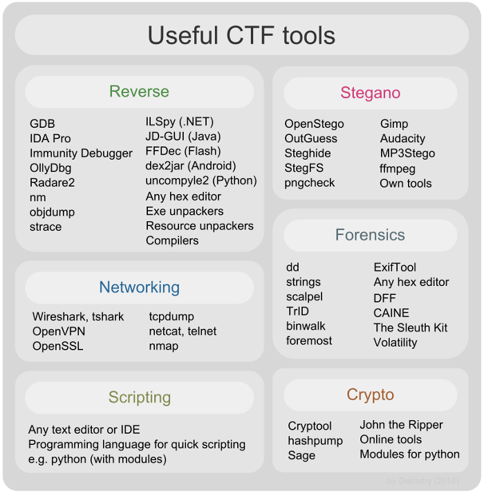

## CTF

### Good Cheat-Sheet for forensic
* [forensic Cheat-Sheet](forensic_cheatsheet.pdf)

### Good Book for buffer-overflows
* [buffer overflows for Dummies](https://www.sans.org/reading-room/whitepapers/threats/paper/481)

### Useful Course for Reverse-Engineering
* [reverse engineering getting started](https://www.pluralsight.com/courses/reverse-engineering-getting-started)

### Useful Course for Penetratin with Python3
* [python for offensive security practical course](https://www.udemy.com/python-for-offensive-security-practical-course/)

