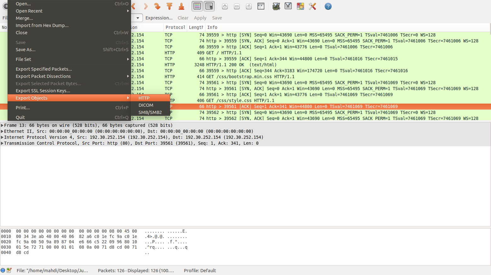
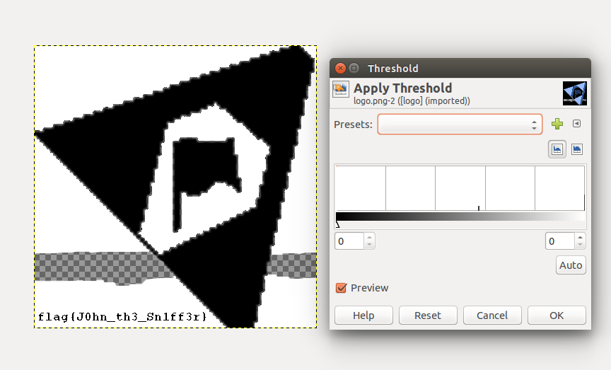

###JOHN IN THE MIDDLE
##### 100 points
Question
--
Can John hijack your surfin'? :)  
`GPG key: GhairfAvvewvukDetolicDer-OcNayd#`  
File: [john-in-the-middle_153a4fa94b9c23459897157df4ed4105.tar.gz.gpg](john-in-the-middle_153a4fa94b9c23459897157df4ed4105.tar.gz.gpg)
Readings
--
* [Thresholding](https://goo.gl/0kCOVL)
Answer

--
First we must export files from the `pcap file`:  
  
Between all files `logo` looks strange:  
  
So we must check logo(changing threshhold):  

#####Flag: `flag{J0hn_the_Sn1ff3r}`
